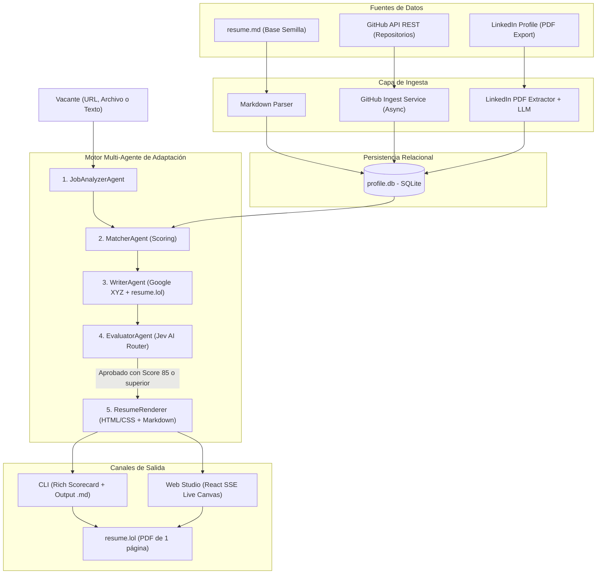
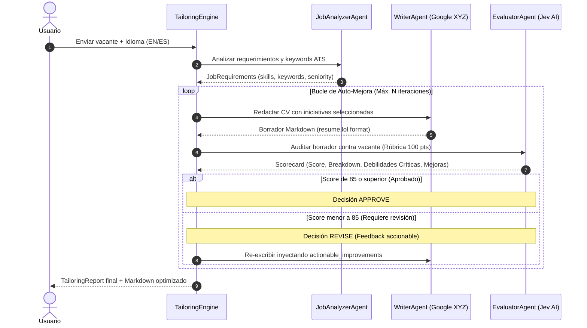
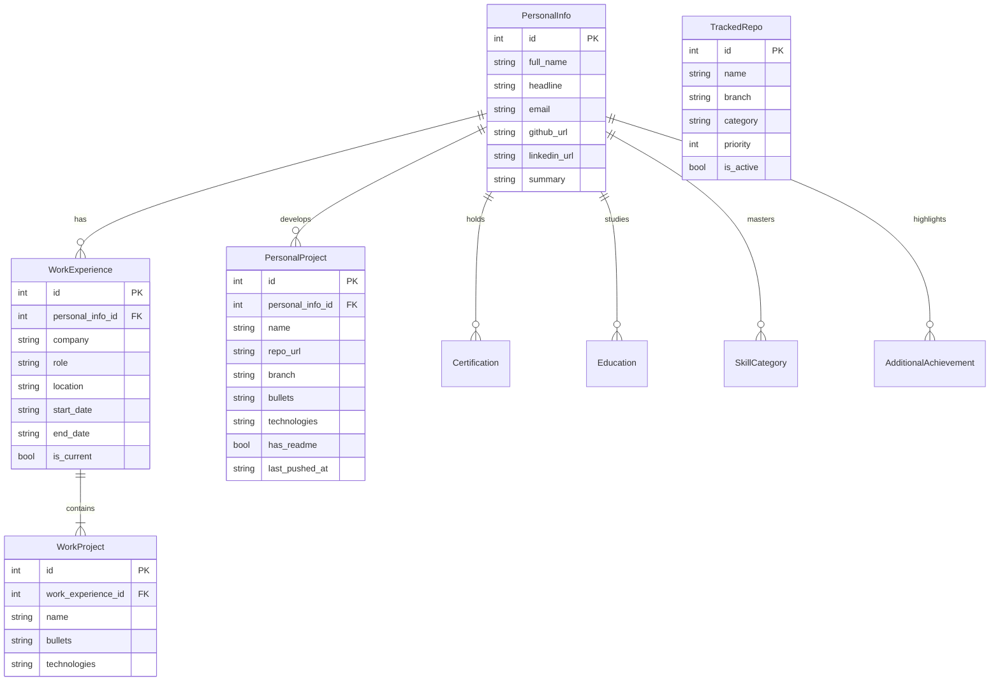

# juanchito-assitant

> **Generador y adaptador inteligente de currículums técnicos para [resume.lol](https://resume.lol)**  
> Construido con arquitectura Multi-Agente, evaluación crítica ATS (Jev Router), ingesta no destructiva desde GitHub y LinkedIn, interfaz web en tiempo real (FastAPI + React 19) y terminal interactiva (Typer + Rich).

---

## Tabla de Contenidos

1. [Visión General y Propósito](#visión-general-y-propósito)
2. [Características Principales](#características-principales)
3. [Arquitectura del Sistema](#arquitectura-del-sistema)
   - [Diagrama de Flujo del Pipeline](#diagrama-de-flujo-del-pipeline)
   - [Bucle Reflexivo de Mejora Continua](#bucle-reflexivo-de-mejora-continua)
   - [Modelo de Datos Relacional](#modelo-de-datos-relacional)
4. [Requisitos Previos](#requisitos-previos)
5. [Instalación y Configuración](#instalación-y-configuración)
6. [Guía de Uso Rápido (Getting Started)](#guía-de-uso-rápido-getting-started)
   - [1. Siembra de Datos Inicial](#1-siembra-de-datos-inicial)
   - [2. Sincronización Inteligente de Fuentes](#2-sincronización-inteligente-de-fuentes)
   - [3. Adaptación de CV desde la Terminal](#3-adaptación-de-cv-desde-la-terminal)
   - [4. Interfaz Web Studio & Workbench](#4-interfaz-web-studio--workbench)
7. [Referencia Completa de Comandos CLI](#referencia-completa-de-comandos-cli)
8. [Estructura del Proyecto](#estructura-del-proyecto)
9. [Pruebas Automatizadas y Calidad](#pruebas-automatizadas-y-calidad)
10. [Autor y Licencia](#autor-y-licencia)

---

## Visión General y Propósito

En el competitivo mercado de ingeniería de software, enviar currículums genéricos o sin cuantificar reduce drásticamente la tasa de conversión en los filtros de sistemas ATS (_Applicant Tracking Systems_) y en la lectura rápida de los reclutadores técnicos.

**juanchito-assitant** resuelve este problema actuando como un copiloto de carrera autónomo:

- **Almacena una fuente única de verdad** en SQLite con tu trayectoria real: empresas, iniciativas técnicas de alto impacto, repositorios de código abierto, certificaciones y habilidades.
- **Ingesta automáticamente tu actividad técnica** desde tus repositorios de GitHub y exportaciones oficiales de LinkedIn sin duplicar ni destruir datos previos.
- **Adapta tu currículum a cualquier vacante** mediante un bucle de agentes que analizan los requerimientos ATS, seleccionan las experiencias más relevantes, redactan viñetas bajo la fórmula **Google XYZ** (_"Logré [X], medido por [Y], haciendo [Z]"_) y autoevalúan el resultado contra una rúbrica estricta de 100 puntos usando el evaluador crítico **Jev AI**.
- **Genera Markdown compatible al 100% con [resume.lol](https://resume.lol)**, listo para exportar a PDF en formato estándar internacional de 1 página con diseño tipográfico impecable.

---

## Características Principales

- **Pipeline Multi-Agente Especializado**:
  - `JobAnalyzerAgent`: Extrae rol, seniority, palabras clave ATS y habilidades obligatorias (_must-have_) y deseables (_nice-to-have_).
  - `MatcherAgent`: Algoritmo de scoring ponderado que ranquea qué proyectos empresariales y proyectos personales de GitHub responden mejor a la vacante.
  - `WriterAgent`: Redacta titulares profesionales, resúmenes técnicos y viñetas cuantificadas Google XYZ respetando límites de extensión para 1 página.
  - `EvaluatorAgent (Jev Router)`: Sistema crítico de auditoría ATS que califica en 5 dimensiones (Match de palabras clave, Relevancia del rol, Impacto cuantificable, Integridad factual y Formato).
- **Soporte Bilingüe Nativo (Inglés / Español)**:
  - Generación de currículums tanto en inglés como en español profesional con preservación de términos técnicos universales (_FastAPI, Docker, Kubernetes, AWS_).
  - Configurable en Web Studio (`[ EN | ES ]`) y CLI (`-l es`).
- **Ingesta Inteligente y Concurrente de GitHub**:
  - Inspección asíncrona de árboles de código y manifiestos (`pyproject.toml`, `package.json`, `Cargo.toml`, etc.).
  - **Detección inteligente de cambios vía `pushed_at`**: Si no hay commits nuevos, omite el repositorio en milisegundos (< 1s para 28 repositorios).
  - Auditoría de documentación: Si un repositorio no tiene README o es trivial, la IA sintetiza un `README.md` profesional completo.
- **Importador No Destructivo de LinkedIn (PDF)**:
  - Extrae texto con `pypdf` y estructura la información con LLM.
  - Compara contra SQLite mediante diffing no destructivo: agrega certificaciones, educación o roles nuevos sin sobrescribir iniciativas existentes.
- **Interfaz Web Studio & Profile Workbench**:
  - Backend en **FastAPI** con **Server-Sent Events (SSE)** para observar en tiempo real cada iteración del bucle reflexivo.
  - Frontend moderno en **React 19 + Tailwind CSS v4 + Vite**: editor visual de perfil, estudio de adaptación lado a lado, scorecard visual ATS y descarga directa en `.md`.
- **Terminal Interactiva de Alta Fidelidad**:
  - Construida con **Typer** y **Rich**: paneles a color, diagnósticos de conectividad, tablas de repositorios y confirmaciones interactivas.

---

## Arquitectura del Sistema

### Diagrama de Flujo del Pipeline



### Bucle Reflexivo de Mejora Continua



### Modelo de Datos Relacional



---

## Requisitos Previos

- **Python**: Versión `>= 3.11`
- **Gestor de Paquetes**: [`uv`](https://docs.astral.sh/uv/) (estándar moderno de empaquetado ultrarrápido en Rust).
- **Node.js**: Versión `>= 18.0.0` y `npm` (solo para compilar la interfaz Web Studio).
- **Proveedor LLM**:
  - Cuenta en [OpenRouter](https://openrouter.ai/) con saldo activo (recomendado, modelos: `qwen/qwen-2.5-coder-32b-instruct`, `deepseek/deepseek-chat`, `anthropic/claude-3.5-sonnet`), o
  - API Key de [Google Gemini](https://ai.google.dev/).
- **GitHub Token (Opcional pero muy recomendado)**: Personal Access Token (PAT) clásico para repositorios privados y evitar límites de tasa de la API pública.

---

## Instalación y Configuración

### 1. Clonar el repositorio

```bash
git clone https://github.com/MateoPissarello/juanchito-assitant.git
cd juanchito-assitant
```

### 2. Configurar el entorno virtual con `uv`

```bash
# Crea el entorno virtual e instala todas las dependencias
uv sync
```

### 3. Configurar variables de entorno (`.env`)

Copia el archivo de ejemplo y configura tus claves:

```bash
cp .env.example .env
```

Edita `.env` con tus credenciales:

```env
# Proveedor principal: OpenRouter
OPENROUTER_API_KEY=sk-or-v1-tu-clave-aqui
MODEL_CV_WRITER=qwen/qwen-2.5-coder-32b-instruct
MODEL_EVALUATOR=qwen/qwen-2.5-coder-32b-instruct
MODEL_REPO_ANALYZER=qwen/qwen-2.5-coder-32b-instruct

# Opcional: Google Gemini SDK
GEMINI_API_KEY=

# GitHub Token (para repositorios públicos y privados)
GITHUB_TOKEN=ghp_tu_token_aqui
```

### 4. Compilar la aplicación Web (React Frontend)

```bash
cd web
npm install
npm run build
cd ..
```

---

## Guía de Uso Rápido (Getting Started)

### 1. Siembra de Datos Inicial

Puebla la base de datos local SQLite (`data/profile.db`) a partir de la plantilla base en Markdown (`data/examples/Backend Engineer/resume.md`):

```bash
uv run juanchito seed
```

### 2. Sincronización Inteligente de Fuentes

Ejecuta el asistente interactivo de sincronización:

```bash
uv run juanchito sync
```

Se desplegará el menú:

```text
¿Qué fuente deseas sincronizar?
  [1] Solo GitHub (repositorios seguidos) [Predeterminado]
  [2] Solo LinkedIn (PDF export)
  [3] Ambos consecutivamente (GitHub + LinkedIn)
```

La consola mostrará eventos en vivo con salto automático de repositorios sin cambios:

```text
  [OMITIDO] goofish-scraping: sin commits nuevos desde 2026-01-29
  [ANALIZANDO] cine_colombia: analizando código con IA (nuevo repositorio)...
  [OK] cine_colombia: guardado con éxito (4 viñetas XYZ, 15 tecnologías)
```

### 3. Adaptación de CV desde la Terminal

Puedes adaptar tu currículum de 3 formas distintas:

```bash
# Modo Interactivo: pregunta origen (URL, texto o archivo) e idioma (EN/ES)
uv run juanchito tailor

# Pasando la descripción directa como argumento
uv run juanchito tailor "Buscamos Senior Backend Engineer con experiencia en Python, FastAPI, Docker y AWS"

# Descargando automáticamente de una URL y redactando en Español
uv run juanchito tailor --url "https://jobs.lever.co/empresa/vacante" --language es
```

Al terminar, la CLI mostrará el **Scorecard ATS**:

```text
╭───────────── Scorecard de Auditoría ATS ─────────────╮
│ Score Global:  94 / 100                             │
│ Decisión:      APPROVE                              │
│ • ATS Keyword Match:    25 / 25                      │
│ • Role Relevance:       24 / 25                      │
│ • Quantifiable Impact:  19 / 20                      │
│ • Factual Integrity:    14 / 15                      │
│ • Format & Length:      12 / 15                      │
╰─────────────────────────────────────────────────────╯
[OK] Currículum guardado en: data/outputs/resume_tailored_senior_backend.md
```

### 4. Interfaz Web Studio & Workbench

Inicia el servidor local de desarrollo:

```bash
uv run juanchito web
```

- Abre automáticamente tu navegador en `http://127.0.0.1:8000`.
- **Profile Workbench**: Visualiza y edita tus experiencias laborales, iniciativas, repositorios y certificaciones.
- **Tailoring Studio**: Pega la descripción de una vacante, selecciona el idioma (`EN` o `ES`), observa el streaming SSE de las iteraciones de la IA y descarga el archivo Markdown listo para importar en [resume.lol](https://resume.lol).

---

## Referencia Completa de Comandos CLI

El comando maestro es `juanchito` (o `uv run juanchito`):

| Comando                       | Parámetros / Banderas                                                                                                                                   | Descripción                                                             |
| :---------------------------- | :------------------------------------------------------------------------------------------------------------------------------------------------------ | :---------------------------------------------------------------------- |
| **`juanchito status`**        | Ninguno                                                                                                                                                 | Diagnóstico en vivo de SQLite, OpenRouter, GitHub API, modelos y rutas. |
| **`juanchito tailor`**        | `[JOB_TEXT]`<br>`-u, --url <URL>`<br>`-f, --file <PATH>`<br>`-l, --language <en\|es>`<br>`-m, --max-iterations <N>`<br>`--dry-run`<br>`--show-markdown` | Orquesta el bucle multi-agente para generar el currículum optimizado.   |
| **`juanchito web`**           | `-h, --host <HOST>`<br>`-p, --port <PORT>`<br>`--open / --no-open`<br>`--reload`                                                                        | Inicia el servidor web FastAPI con el Profile Workbench en React.       |
| **`juanchito sync`**          | Menú interactivo `[1/2/3]`                                                                                                                              | Sincroniza fuentes externas hacia SQLite.                               |
| **`juanchito sync github`**   | `-u, --user <USER>`<br>`-a, --all`<br>`-r, --repo <NAME>`<br>`-c, --concurrency <N>`<br>`-f, --force`                                                   | Sincronización directa y configurable de repositorios de GitHub.        |
| **`juanchito sync linkedin`** | `[PDF_PATH]`<br>`-d, --dry-run`<br>`-y, --yes`<br>`--include-non-technical`<br>`-p, --provider <openrouter\|gemini>`                                    | Ingesta no destructiva desde exportación PDF oficial de LinkedIn.       |
| **`juanchito repo list`**     | Ninguno                                                                                                                                                 | Lista los repositorios configurados para seguimiento en SQLite.         |
| **`juanchito repo add`**      | `<NAME>`<br>`-b, --branch <BRANCH>`<br>`-c, --category <CAT>`<br>`-s, --sync / --no-sync`                                                               | Registra un repo y ofrece auto-sincronizarlo de inmediato con IA.       |
| **`juanchito repo toggle`**   | `<NAME>`                                                                                                                                                | Activa o desactiva la sincronización de un repositorio sin borrarlo.    |
| **`juanchito repo remove`**   | `<NAME>`                                                                                                                                                | Elimina un repositorio de la tabla de seguimiento.                      |
| **`juanchito audit`**         | Ninguno                                                                                                                                                 | Inspección exhaustiva de todos los datos persistidos en `profile.db`.   |
| **`juanchito seed`**          | `-r, --resume <PATH>`<br>`-f, --force`                                                                                                                  | Restablece la base de datos a partir del currículum semilla.            |

---

## Estructura del Proyecto

```text
juanchito-assitant/
├── data/
│   ├── examples/Backend Engineer/
│   │   └── resume.md               # Plantilla semilla de referencia para resume.lol
│   ├── outputs/                    # Currículums adaptados generados (.md)
│   ├── linkedin_profile.pdf        # Exportación oficial de LinkedIn (opcional)
│   └── profile.db                  # Base de datos SQLite gestionada por SQLModel
├── src/juanchito_assitant/
│   ├── agents/                     # Agentes cognitivos autónomos
│   │   ├── cv_writer.py            # Redactor con soporte Google XYZ y bilingüe
│   │   ├── evaluator.py            # Evaluador crítico ATS (Jev Router 100 pts)
│   │   ├── job_analyzer.py         # Extractor de requerimientos ATS y keywords
│   │   ├── linkedin_parser.py      # Parser estructurado de PDF de LinkedIn
│   │   ├── matcher.py              # Algoritmo de ranking y scoring de experiencias
│   │   └── repo_analyzer.py        # Analizador de código GitHub + json-repair
│   ├── db/
│   │   ├── database.py             # Engine de SQLModel y sesiones
│   │   └── seed.py                 # Poblador inicial de la base de datos
│   ├── ingest/
│   │   ├── github_client.py        # Cliente HTTP REST asíncrono para GitHub
│   │   ├── github_ingest.py        # Orquestador con caché inteligente pushed_at
│   │   ├── import_linkedin.py      # Flujo de importación CLI de LinkedIn
│   │   ├── linkedin_enricher.py    # Diffing no destructivo sobre SQLite
│   │   ├── markdown_parser.py      # Parser dinámico de Markdown de resume.lol
│   │   ├── pdf_extractor.py        # Extractor de texto plano con pypdf
│   │   └── sync_github.py          # Comando ejecutable de sincronización GitHub
│   ├── models/
│   │   ├── evaluation.py           # Modelos Pydantic del Scorecard ATS
│   │   ├── job.py                  # Modelos Pydantic de la vacante analizada
│   │   └── profile.py              # Modelos SQLModel relacionales
│   ├── rendering/
│   │   └── resume_renderer.py      # Generador de Markdown / HTML resume.lol (EN/ES)
│   ├── web/
│   │   ├── api.py                  # Endpoints REST y Server-Sent Events (SSE)
│   │   ├── app.py                  # Servidor FastAPI montado con SPA
│   │   └── schemas.py              # Esquemas de intercambio API
│   ├── cli.py                      # Interfaz interactiva de terminal (Typer + Rich)
│   ├── config.py                   # Configuración y resolución de rutas con .env
│   └── tailor_engine.py            # Orquestador del bucle reflexivo de auto-mejora
├── web/                            # Frontend Web Studio (React 19 + Tailwind v4)
│   ├── src/                        # Componentes React, Workbench y Canvas
│   ├── dist/                       # Artefactos compilados servidos por FastAPI
│   └── package.json                # Dependencias de Vite y React
├── tests/                          # Suite completa de pruebas con pytest
│   ├── test_cli.py
│   ├── test_db.py
│   ├── test_github_client.py
│   ├── test_github_ingest.py
│   ├── test_linkedin_enricher.py
│   ├── test_linkedin_parser.py
│   ├── test_pdf_extractor.py
│   ├── test_repo_analyzer.py
│   ├── test_resume_renderer.py
│   ├── test_seed.py
│   ├── test_tailor_engine.py
│   └── test_web_api.py
├── AGENTS.md                       # Protocolo de Pair Programming y reglas para agentes
├── LOGBOOK.md                      # Bitácora cronológica viva de decisiones técnicas
├── pyproject.toml                  # Definición del paquete y dependencias con uv
└── README.md                       # Documentación principal del proyecto
```

---

## Pruebas Automatizadas y Calidad

El proyecto mantiene una cobertura integral en todas sus capas (Base de datos, Clientes HTTP, Ingesta, Agentes, Renderizado, API REST y CLI interactiva).

Ejecución de toda la suite de pruebas:

```bash
uv run pytest tests/
```

Salida esperada:

```text
============================== test session starts ==============================
collected 46 items

tests/test_cli.py .............                                          [ 28%]
tests/test_db.py ...                                                     [ 34%]
tests/test_github_client.py ...                                          [ 41%]
tests/test_github_ingest.py ....                                         [ 50%]
tests/test_linkedin_enricher.py .                                        [ 52%]
tests/test_linkedin_parser.py .                                          [ 54%]
tests/test_pdf_extractor.py ..                                           [ 58%]
tests/test_repo_analyzer.py .....                                        [ 69%]
tests/test_resume_renderer.py ..                                         [ 73%]
tests/test_seed.py .                                                     [ 76%]
tests/test_tailor_engine.py ....                                         [ 84%]
tests/test_web_api.py .......                                            [100%]

======================== 46 passed, 1 warning in 3.51s =========================
```

---

## Autor y Licencia

- **Lead Developer**: Mateo Pissarello ([@MateoPissarello](https://github.com/MateoPissarello))
- **Licencia**: Distribuido bajo la licencia [MIT](LICENSE).

---
